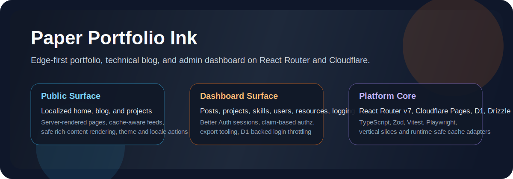
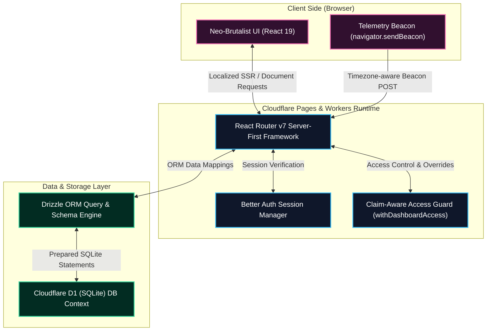
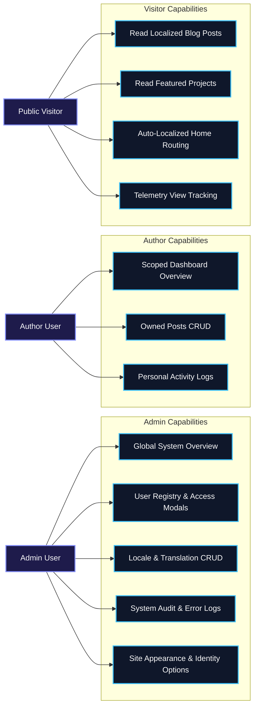

# Paper Portfolio Ink

Edge-first personal portfolio and technical blog built with React Router v7, Cloudflare Pages, and D1. The project combines a localized public website with a protected admin dashboard for content, users, resources, and operational logging.

<p>
  
  
  
  
  
  
</p>



## Highlights

- Server-first React Router architecture with Cloudflare-compatible runtime boundaries.
- Localized public routes under `/:locale/*` backed by database-driven i18n.
- Protected admin dashboard with Better Auth session handling and claim-based authorization.
- D1-backed content management for posts, projects, skills, users, locales, and translations.
- Operational logging, error logging, export tooling, and dashboard security hardening.
- Full TypeScript, Zod validation, Vitest coverage, and Playwright end-to-end checks.
- Dynamic dashboard overview with parallelized database count metrics, recent logs feed, and custom SVG traffic analytics.
- Granular role and claim override management using interactive access modals in the user registry.
- Custom HSL accent colors, typography selections, and site configuration parameters managed through settings.
- Safe public blog post view tracking with timezone offset adjustments and a double-lock mechanism (24h cookie + 12h DB IP lock).
- Performant keyset pagination and SpreadsheetML Excel workbook export downloads.

## Technical Architecture

The following diagram illustrates the edge-first server-first architecture connecting the Client, Cloudflare Workers Pages Runtime, and Cloudflare D1 SQLite Database:



## System Use Cases

The role-based authorization model differentiates capabilities across Admin, Author, and Public Visitors:



## Tech Stack

- React 19
- React Router v7
- TypeScript
- Tailwind CSS v4
- Cloudflare Pages / Workers
- Cloudflare D1
- Drizzle ORM
- Better Auth
- Zod
- Vitest
- Playwright

## Application Surfaces

| Surface     | Focus                            | Primary routes                                     |
| ----------- | -------------------------------- | -------------------------------------------------- |
| Public site | Localized content delivery       | `/:locale`, `/:locale/blog`, `/:locale/projects`   |
| Dashboard   | Protected CRUD and operations    | `/:locale/dashboard/*`                             |
| System      | Auth and browser/runtime actions | `/api/auth/*`, `/:locale/login`, `/:locale/logout` |

### Public Site

- Localized home page at `/:locale`
- Blog index, feed, and post detail routes
- Projects index and feed routes
- Locale switching and theme persistence
- Same-origin blog post view telemetry tracking with cookie and DB double-locks

### Admin Dashboard

- Protected dashboard under `/:locale/dashboard`
- Post, project, skill, and user management
- Locale and translation management
- Logging, export, and delete workflows for audit and error history
- Granular role and claim override access modals in the user registry
- Custom HSL accents, fonts, and account parameter configurations under Settings
- Scoped post-performance analytics (views, scroll rates, time spent) and custom SVG trends charts

## Project Structure

```text
app/
  domain/      Shared domain contracts and parsing logic
  features/    Vertical slices for public and dashboard surfaces
  routes/      Thin route entrypoints mapped in app/routes.ts
  shared/      App-wide auth, authz, i18n, cache, error, and logging modules
db/
  migrations/  D1 schema migrations
  schema.ts    Drizzle schema source of truth
docs/
  features/    Task and maintenance documentation
  lessons.md   Ongoing engineering lessons learned
workers/
  Cloudflare-specific runtime adapters
```

## Prerequisites

- Node.js `>=20.11.0`
- npm `>=10`
- A local `.env` file based on `.env.example`
- Wrangler available through project dependencies

## Quick Start

### 1. Install dependencies

```bash
npm install
```

### 2. Create local environment variables

```bash
cp .env.example .env
```

Required variables:

- `BETTER_AUTH_SECRET`
- `BETTER_AUTH_URL`

### 3. Apply local database migrations

```bash
npm run db:migrate:local
```

### 4. Seed a local admin account

```bash
npm run db:seed:test-user
```

Default local credentials:

- Email: `admin@paper-portfolio-ink.local`
- Password: `fixture-local-only-password-admin`

### 5. Start local development

```bash
npm run dev
```

Open `http://localhost:5173`.

## Common Commands

```bash
npm run dev
npm run build
npm run preview
npm run db:migrate:local
npm run db:migrations:list:local
npm run db:seed:test-user
npm test
npm run typecheck
npm run lint
npm run format:check
npm run e2e:prepare
npm run e2e
```

## Testing And Verification

The project expects the following verification flow for meaningful changes:

```bash
npm test
npm run typecheck
npm run lint
npm run format:check
npm run e2e:prepare
npm run e2e
```

## Deployment Notes

- `npm run preview` builds the app and runs it through Wrangler locally.
- `npm run deploy` builds and deploys through Wrangler.
- D1 bindings are configured in [wrangler.toml](./wrangler.toml).
- Migrations live in [db/migrations](./db/migrations).

## Documentation

- [Detailed Usage Guide](./docs/usage-guide.md)
- [Engineering Standards](./docs/engineering-standards.md)
- [Agent Workflow](./docs/agent-workflow.md)
- [Roadmap](./docs/roadmap.md)
- [Lessons Learned](./docs/lessons.md)

## Visual Map

The deeper operator flow is documented with a dedicated image-backed guide:

- [Detailed Usage Guide](./docs/usage-guide.md)
- [Usage Guide Visual Map](./docs/assets/usage-guide-map.svg)

## Detailed Feature Notes

Implementation history and maintenance decisions are tracked under [docs/features](./docs/features).
