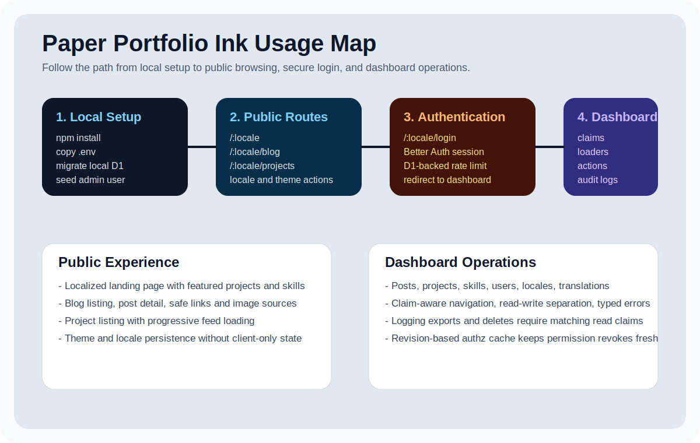
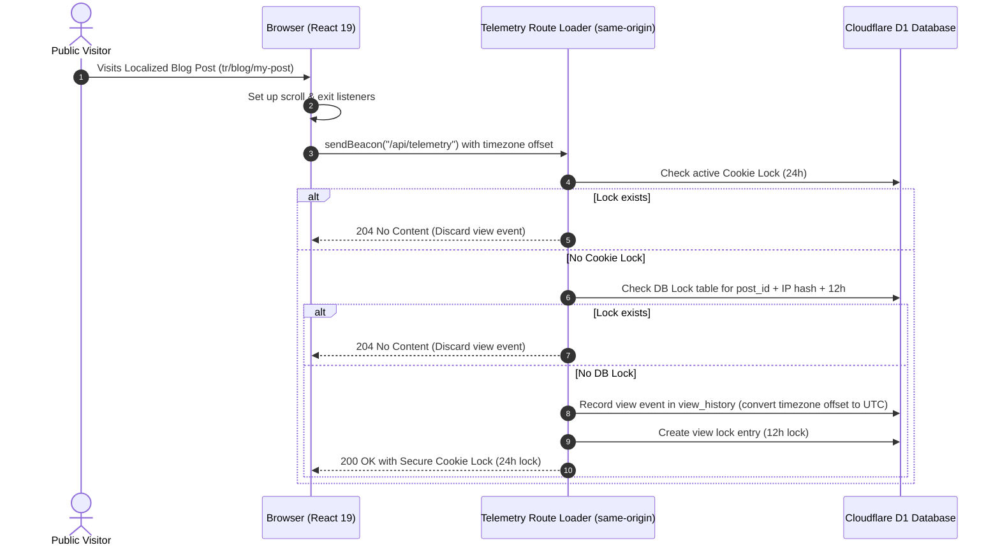

# Paper Portfolio Ink Usage Guide

This guide explains how to use the project locally, how the public site behaves, and how to operate the admin dashboard safely.

<p>
  
  
  
  
  
</p>



## 1. Local Setup Workflow

| Step      | Command                     | Purpose                                       |
| --------- | --------------------------- | --------------------------------------------- |
| Install   | `npm install`               | Installs application and tooling dependencies |
| Configure | `cp .env.example .env`      | Creates the local auth configuration source   |
| Migrate   | `npm run db:migrate:local`  | Applies local D1 schema migrations            |
| Seed      | `npm run db:seed:test-user` | Creates a local admin account                 |
| Run       | `npm run dev`               | Starts the localized app in development mode  |

### Install and configure

```bash
npm install
cp .env.example .env
```

Set these values in `.env`:

- `BETTER_AUTH_SECRET`
- `BETTER_AUTH_URL`

For standard local development, use:

- `BETTER_AUTH_URL=http://localhost:5173`

### Apply the local database

```bash
npm run db:migrate:local
```

This applies every migration in [db/migrations](../db/migrations).

Below is the complete Entity Relationship (ER) diagram mapping all 19 database schemas, their complete fields, and foreign key associations:

```mermaid
erDiagram
    users ||--o{ posts : "author_id references id"
    users ||--o{ sessions : "user_id references id"
    users ||--o{ accounts : "user_id references id"
    users ||--o{ authorization_user_claim_overrides : "user_id references id"
    users ||--o{ log_history : "user_id references id"
    users ||--o{ log_error_history : "user_id references id"
    posts ||--o{ view_history : "post_id references id"
    posts ||--o{ view_history_locks : "post_id references id"
    locales ||--o{ translations : "locale references code"
    authorization_claims ||--o{ authorization_role_claims : "claim_key references key"
    authorization_claims ||--o{ authorization_user_claim_overrides : "claim_key references key"

    users {
        text id PK
        text email UK
        boolean email_verified
        text display_name
        boolean is_active
        text role
        integer authz_version
        text avatar_url
        text bio
        timestamp created_at
        timestamp updated_at
    }
    posts {
        text id PK
        text author_id FK
        text title
        text slug UK
        text excerpt
        text content
        text cover_image_url
        integer reading_time_minutes
        text status
        timestamp published_at
        timestamp created_at
        timestamp updated_at
    }
    projects {
        text id PK
        text title
        text slug UK
        text summary
        text description
        text repository_url
        text live_url
        text cover_image_url
        text status
        boolean is_featured
        integer sort_order
        timestamp created_at
        timestamp updated_at
    }
    skills {
        text id PK
        text icon_key
        text name
        integer sort_order
        text slug UK
        text summary
        timestamp created_at
        timestamp updated_at
    }
    sessions {
        text id PK
        text user_id FK
        text token UK
        timestamp expires_at
        text ip_address
        text user_agent
        timestamp created_at
        timestamp updated_at
    }
    accounts {
        text id PK
        text user_id FK
        text account_id
        text provider_id
        text access_token
        text refresh_token
        text id_token
        timestamp access_token_expires_at
        timestamp refresh_token_expires_at
        text scope
        text password
        timestamp created_at
        timestamp updated_at
    }
    verifications {
        text id PK
        text identifier
        text value
        timestamp expires_at
        timestamp created_at
        timestamp updated_at
    }
    authorization_claims {
        text key PK
        text resource
        text action
        text scope
        text description
        timestamp created_at
        timestamp updated_at
    }
    authorization_role_claims {
        text role PK
        text claim_key PK, FK
        timestamp created_at
        timestamp updated_at
    }
    authorization_user_claim_overrides {
        text user_id PK, FK
        text claim_key PK, FK
        text effect
        timestamp created_at
        timestamp updated_at
    }
    authorization_state {
        text key PK
        integer revision
        timestamp updated_at
    }
    locales {
        text code PK
        text label
        boolean is_active
        boolean is_default
        integer sort_order
        timestamp created_at
        timestamp updated_at
    }
    translations {
        text locale PK, FK
        text key PK
        text value
        timestamp created_at
        timestamp updated_at
    }
    configuration_parameters {
        text key PK
        text value
        timestamp created_at
        timestamp updated_at
    }
    login_rate_limits {
        text scope PK
        text identifier_hash PK
        integer failure_count
        timestamp window_started_at
        timestamp blocked_until
        timestamp created_at
        timestamp updated_at
    }
    view_history_locks {
        text post_id PK, FK
        text user_hash PK
        timestamp locked_until
        timestamp created_at
        timestamp updated_at
    }
    view_history {
        text id PK
        text post_id FK
        text user_hash
        integer scroll_rate
        integer seconds_spent
        timestamp created_at
    }
    log_history {
        text id PK
        text request_id
        text resource
        text action
        text result
        integer status_code
        text message
        text path
        text method
        text user_id FK
        text user_role
        text target_id
        text target_label
        text metadata_json
        timestamp created_at
    }
    log_error_history {
        text id PK
        text request_id
        text fingerprint
        text code
        text category
        text severity
        integer status_code
        text message
        text path
        text method
        text route_id
        text locale
        text user_id FK
        text user_role
        text stack
        text metadata_json
        timestamp created_at
    }
```



### Seed a local admin user

```bash
npm run db:seed:test-user
```

Default local-only credentials:

- Email: `admin@paper-portfolio-ink.local`
- Password: `fixture-local-only-password-admin`

### Start the app

```bash
npm run dev
```

Open `http://localhost:5173`.

## 2. Public Site Guide

All public routes are localized and live under `/:locale/*`. The default locale redirect is handled automatically.

| Area       | Route group                         | Notes                                          |
| ---------- | ----------------------------------- | ---------------------------------------------- |
| Home       | `/:locale`                          | Portfolio landing page with featured content   |
| Blog       | `/:locale/blog*`                    | Feed and post detail routes                    |
| Projects   | `/:locale/projects*`                | Public project listing and progressive loading |
| UI actions | `/:locale/locale`, `/:locale/theme` | Locale and theme persistence                   |

### Home page

Route:

- `/:locale`

What it provides:

- Hero and portfolio introduction
- Featured projects
- Skill section sourced from the database
- Links into the public blog and projects surfaces

Behavior notes:

- If there are no skills in the database, the skill section is hidden.
- Theme preference is persisted server-side.

### Blog

Routes:

- `/:locale/blog`
- `/:locale/blog/feed`
- `/:locale/blog/:slug`

What it provides:

- Paginated or incremental post listing
- SEO-aware post detail pages
- Safe rich-content rendering

Behavior notes:

- Public blog content is rendered from structured document content, not raw HTML.
- External links and image sources are sanitized before rendering.
- Telemetry view tracking triggers via `navigator.sendBeacon` when the visitor reaches a scroll percentage or leaves the page.
- Telemetry processing is protected by a same-origin guard and a double-lock check (a 24-hour browser cookie lock plus a 12-hour server-side IP hash lock) to prevent view inflation, with timezone offset logic adjusting browser time to UTC.

The detailed execution sequence of the double-lock view telemetry flow is outlined below:



### Projects

Routes:

- `/:locale/projects`
- `/:locale/projects/feed`

What it provides:

- Public project listing
- Progressive loading for larger lists

Behavior notes:

- Only public-facing project data is exposed.
- Admin-only metadata stays inside dashboard-only slices.

### Locale and theme controls

Routes:

- `/:locale/locale`
- `/:locale/theme`

What they provide:

- Locale switching
- Theme switching

Behavior notes:

- Locale changes keep users inside the localized route system.
- Theme changes are persisted without requiring client-only state.

## 3. Authentication Guide

### Login

Route:

- `/:locale/login`

Expected flow:

1. Open the localized login page.
2. Submit email and password.
3. If the user is authorized for dashboard access, the session is created and the user is redirected to the requested dashboard route.

Important security behavior:

- Login attempts are rate-limited through D1-backed email and IP buckets.
- Invalid credentials, inactive users, and repeated failures are tracked.
- Successful login clears matching throttle state for that identity.

### Logout

Route:

- `/:locale/logout`

Behavior notes:

- Logout is handled server-side.
- Session cookies are cleared as part of the route action.

## 4. Dashboard Guide

The dashboard is mounted under `/:locale/dashboard` and protected by session and claim checks.

| Section   | Route                            | Main capability                                     |
| --------- | -------------------------------- | --------------------------------------------------- |
| Overview  | `/:locale/dashboard`             | Entry shell and permission-aware navigation         |
| Posts     | `/:locale/dashboard/posts`       | Post CRUD with owner or any-scope authz             |
| Projects  | `/:locale/dashboard/projects`    | Project CRUD with read-write claim split            |
| Skills    | `/:locale/dashboard/skills`      | Lightweight registry management                     |
| Users     | `/:locale/dashboard/users`       | User management with admin safeguards               |
| Resources | `/:locale/dashboard/resources/*` | Locale and translation administration               |
| Settings  | `/:locale/dashboard/settings`    | Dynamic appearance palette/fonts and configurations |
| Analytics | `/:locale/dashboard/analytics`   | Post-performance tracking and traffic trends        |
| Logging   | `/:locale/dashboard/logging*`    | Audit and error operations                          |

### Dashboard overview

Route:

- `/:locale/dashboard`

What it provides:

- The main shell for authenticated users
- Navigation into all allowed dashboard sections
- Dynamic counts (total posts, total projects, active users, total skills) parallelized via `Promise.all`
- Inline SVG traffic analytics charts displaying daily and monthly visitor page views
- System activity logs feed (last 5 records) and recently updated posts list

Behavior notes:

- Navigation visibility and metric counts are claim-aware.
- Metric cards display "Yetkisiz" (Unauthorized) if the user lacks the specific read claim.
- Log feeds and recent posts filter automatically: Admins see system-wide records, Authors only see their own.
- Heavily nested views aggregates are completely skipped if the session lacks analytics read claims.

### Posts management

Route:

- `/:locale/dashboard/posts`

What it provides:

- Post listing
- Create, update, and delete flows
- Rich-text editing

Behavior notes:

- Authorization follows owner or any-scope rules depending on claim set.
- Unsupported mutation intents are rejected before action dispatch.

### Projects management

Route:

- `/:locale/dashboard/projects`

What it provides:

- Project listing
- Create, update, and delete flows

Behavior notes:

- Reads and writes are split into separate claims.
- Duplicate or conflicting writes are surfaced through typed form-state errors.

### Skills management

Route:

- `/:locale/dashboard/skills`

What it provides:

- Lightweight registry management for skill records

Behavior notes:

- Icons are selected through a controlled key registry.
- Sorting is stored in the database.

### Users management

Route:

- `/:locale/dashboard/users`

What it provides:

- User listing
- Create, update, and delete flows
- Role-aware safeguards
- Granular role and claim override management using interactive access modals

Behavior notes:

- The app protects against removing the last active admin.
- Reads and writes are guarded separately.
- Administrators can open the Access Modal for any user to modify their role and explicitly override specific claims with 'grant' or 'revoke' effects.

### Resources management

Routes:

- `/:locale/dashboard/resources`
- `/:locale/dashboard/resources/locales`
- `/:locale/dashboard/resources/translations`

What it provides:

- Locale registry CRUD
- Translation registry CRUD
- Permission-aware redirects between the two subsections

Behavior notes:

- Locale and translation access are authorized independently.
- A user with access to only one subsection is redirected away from unreadable sections.
- Locale changes invalidate the related cached i18n payloads.

### Logging

Routes:

- `/:locale/dashboard/logging`
- `/:locale/dashboard/logging/export`

What it provides:

- Audit log and error log views
- Standardized `(createdAt, id)` composite index keyset pagination
- Excel SpreadsheetML workbook (`.xlsx`) export tool
- Range delete workflow

Behavior notes:

- Export and delete actions require the matching read permission in addition to the action permission.
- Audit and error tabs are permission-aware independently.
- Keyset pagination prevents slow table scans on large SQLite tables.
- Excel output provides spreadsheet-compatible `.xlsx` workbook formats instead of plain `.xls`.

### Settings management

Route:

- `/:locale/dashboard/settings`

What it provides:

- Dynamic theme styling under `/settings/appearance` (custom HSL accent color selections and Google Fonts families)
- Core account configurations under `/settings/account` (email, social link parameters, custom domain url)
- Clickable configuration cards that trigger popup modal editors

Behavior notes:

- All parameter states are saved inside the generic `configuration_parameters` database table.
- A caching layer dynamically warms up parameter variables on first request, purging keys upon settings mutations to guarantee consistency.

### Analytics

Route:

- `/:locale/dashboard/analytics`

What it provides:

- System-wide and author-scoped post-performance statistics (view counts, average scroll rates, average time spent)
- Custom HSL-accented SVG charts showing daily and monthly traffic trends
- Modal popup details for individual post trend analytics

Behavior notes:

- Access control gates page loading strictly based on roles and claims overrides (`analyticsReadAny` or `analyticsReadOwn`).
- Admins see performance metrics for all system posts, while Authors are restricted to their owned posts.

## 5. Authorization Model

The project uses claim-based authorization backed by D1.

Key principles:

- The database is the source of truth for role claims and user overrides.
- Session authz versioning exists, but role and override changes also drive a global authorization revision.
- Cross-request authorization caching is safe because cache keys include `authorization_state.revision`.

Operational impact:

- Revoking a role claim or user override invalidates future cached claim sets.
- Sensitive routes do not trust UI visibility alone; server loaders and actions enforce policy again.

Below is the dynamic role & claims matrix mapping default permission allocations:

| Registry / Surface        | Claim Key                                                                                 | Default Admin | Default Author |
| :------------------------ | :---------------------------------------------------------------------------------------- | :-----------: | :------------: |
| **Dashboard Access**      | `dashboardAccess`                                                                         |      Yes      |      Yes       |
| **Posts (Read All)**      | `postsReadAny`                                                                            |      Yes      |       No       |
| **Posts (Read Own)**      | `postsReadOwn`                                                                            |      Yes      |      Yes       |
| **Posts (Write/Delete)**  | `postsCreate`, `postsUpdate*`, `postsDelete*`                                             |      Yes      |  Scoped (Own)  |
| **Projects (Read/Write)** | `projectsRead`, `projectsCreate`, `projectsUpdate`, `projectsDelete`                      |      Yes      |       No       |
| **Skills (Read/Write)**   | `skillsRead`, `skillsCreate`, `skillsUpdate`, `skillsDelete`                              |      Yes      |       No       |
| **Users (Read/Write)**    | `usersRead`, `usersCreate`, `usersUpdate`, `usersDelete`                                  |      Yes      |       No       |
| **Locales (Read/Write)**  | `resourcesLocalesRead`, `resourcesLocalesCreate`, `resourcesLocalesDelete`                |      Yes      |       No       |
| **Translations (R/W)**    | `resourcesTranslationsRead`, `resourcesTranslationsCreate`, `resourcesTranslationsDelete` |      Yes      |       No       |
| **Logging (Read/Purge)**  | `logsAuditRead`, `logsAuditDelete`, `logsErrorRead`, `logsErrorDelete`                    |      Yes      |       No       |
| **Analytics (Read)**      | `analyticsReadAny`, `analyticsReadOwn`                                                    |      Yes      |  Scoped (Own)  |

## 6. Testing Workflow

### Unit and integration tests

```bash
npm test
```

### Type, lint, and formatting checks

```bash
npm run typecheck
npm run lint
npm run format:check
```

### End-to-end tests

```bash
npm run e2e:prepare
npm run e2e
```

Notes:

- `e2e:prepare` applies local migrations and seeds deterministic browser fixtures.
- The seed process also resets stateful security tables such as login rate limits.

### E2E Test Personas

When running Playwright tests, the test environment is pre-seeded with specialized persona configurations to validate fine-grained claim boundaries:

| Persona                  | E2E Seed Email                                   | Core Role | Specific Claim Overrides / Test Goals                                                                                                |
| :----------------------- | :----------------------------------------------- | :-------- | :----------------------------------------------------------------------------------------------------------------------------------- |
| **Admin**                | `admin@paper-portfolio-ink.local`                | `admin`   | Full system access. Used to verify global dashboards, settings parameters, logging tabs, and charts.                                 |
| **Author**               | `author@paper-portfolio-ink.local`               | `author`  | Standard writing privileges. Verified to lock unauthorized cards (showing `"Yetkisiz"`) and strictly scope feeds to owned content.   |
| **Registry Auditor**     | `registry-auditor@paper-portfolio-ink.local`     | `author`  | Override grants: `projectsRead`, `skillsRead`, `usersRead`. Verified to read but forbidden from mutating projects, skills, or users. |
| **Locale Operator**      | `locale-operator@paper-portfolio-ink.local`      | `author`  | Override grants: locales CRUD. Checked to redirect from translations index and mutate locale records.                                |
| **Translation Operator** | `translation-operator@paper-portfolio-ink.local` | `author`  | Override grants: translations CRUD. Checked to redirect from locales index and mutate translations.                                  |
| **Log Exporter**         | `log-exporter@paper-portfolio-ink.local`         | `author`  | Override grants: `logsAuditExport`, `logsErrorExport`. Verified to block exports without read permissions.                           |
| **Log Cleaner**          | `log-cleaner@paper-portfolio-ink.local`          | `author`  | Override grants: `logsAuditDelete`, `logsErrorDelete`. Verified to block cleans without read permissions.                            |
| **Revoked Admin**        | `revoked-admin@paper-portfolio-ink.local`        | `admin`   | Override revokes: users CRUD claims. Verified to strictly block admin actions on user registries after overrides.                    |

## 7. Recommended Local Operator Flows

### When you only need the public site

1. Run migrations.
2. Start `npm run dev`.
3. Visit localized public routes such as `/tr`, `/tr/blog`, or `/tr/projects`.

### When you need dashboard access

1. Run migrations.
2. Seed the local admin user.
3. Start `npm run dev`.
4. Sign in at `/tr/login`.
5. Open `/tr/dashboard`.

### When you need realistic browser verification

1. Run `npm run e2e:prepare`.
2. Run `npm run e2e`.
3. Review Playwright failures in `test-results/` if any scenario fails.

## 8. Related Documentation

- [README](../README.md)
- [README Overview Visual](./assets/readme-hero.svg)
- [Engineering Standards](./engineering-standards.md)
- [Agent Workflow](./agent-workflow.md)
- [Roadmap](./roadmap.md)
- [Lessons Learned](./lessons.md)
